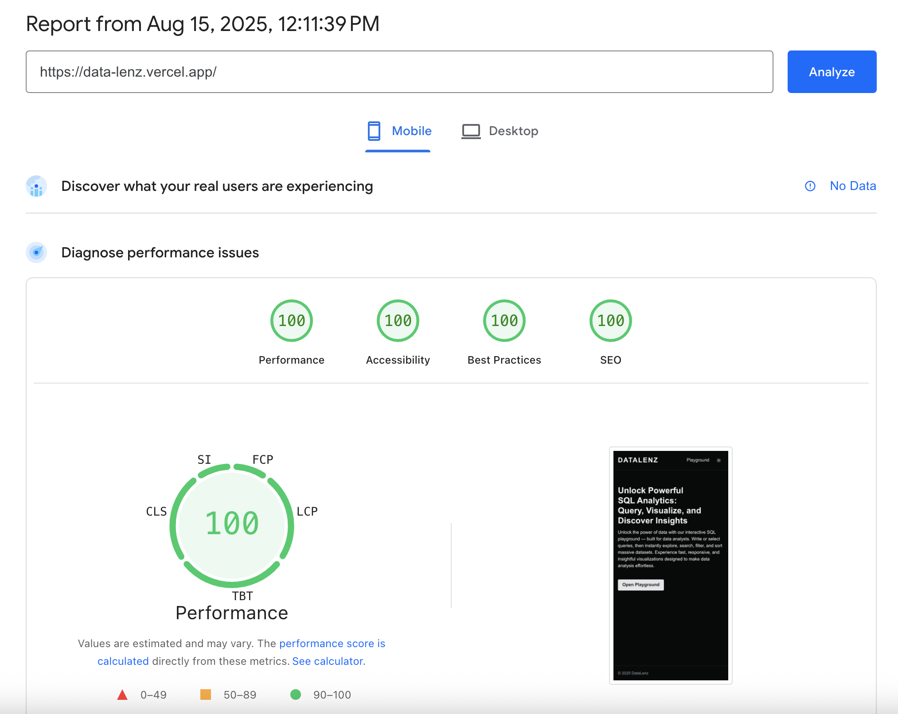

# DataLenz

**Live App** → [https://data-lenz.vercel.app/](https://data-lenz.vercel.app/)  
**Video Demo** → _[Coming Soon]_

**DataLenz** is a high-performance data exploration interface built with **Next.js 15.4.6**, deployed on **Vercel** for global, fast, and secure delivery.  
It enables developers, analysts, and technical teams to query, visualize, and interact with data directly in the browser.

---

## 🚀 Walkthrough

### Core Features

- **Data Tables & Virtualized Lists** — Built with `@tanstack/react-table` and virtual scrolling for rendering large datasets efficiently.
- **Robust Pagination** — Handles large datasets efficiently with server/client-side pagination.
- **Advanced Filtering** — Multiple filters with instant updates.
- **Column Picker** — Show/hide specific columns dynamically.
- **Save Queries** — Users can store and re-run frequently used queries.
- **Async Data Fetching & Caching** — Managed via `@tanstack/react-query` to handle loading, error states, and background updates gracefully.
- **Dynamic Theming** — Implemented with `next-themes` and Radix UI primitives for a11y-compliant, accessible design.
- **State Management** — Global and component-level state handled via [zustand](https://github.com/pmndrs/zustand) for simplicity and performance.
- **Interactive Code Editing** — Powered by [Monaco Editor](https://github.com/suren-atoyan/monaco-react) for syntax highlighting, auto-completion, and a smooth editing experience.
- **Optimized Performance** — Lighthouse LCP ~1.7s (mobile), CLS `0`, TBT `0ms`.

### User Benefits

- **Speed** — Optimized rendering and data fetching for minimal wait times.
- **Clarity** — A clean, consistent interface that is easy to navigate.
- **Accessibility** — Built with WCAG and keyboard navigation in mind.

---

## 🛠 JavaScript Framework & Major Packages

- **Framework**: [Next.js 15.4.6](https://nextjs.org/) — Hybrid rendering (SSR/SSG), built-in routing, image optimization, and performance tooling.
- **Core Libraries**:
  - React 19.1.0
  - Tailwind CSS 4.x
  - @tanstack/react-query
  - @tanstack/react-table
  - @monaco-editor/react
  - zustand
  - Radix UI components (`@radix-ui/react-*`)
  - next-themes
- **Developer Tooling**:
  - TypeScript (strict mode)
  - ESLint + Prettier (with `prettier-plugin-tailwindcss`)
  - Husky + lint-staged (pre-commit checks)

---

## ⏱ Page Load Time & Measurement

**Measurement Methodology**  
Load time was measured using:

- **Lighthouse** in Chrome DevTools
- **Web Vitals** metrics (Largest Contentful Paint, First Input Delay, Cumulative Layout Shift)

**Results (Mobile)**

- First Contentful Paint (FCP): `~0.9s`
- Largest Contentful Paint (LCP): `~1.7s`
- Cumulative Layout Shift (CLS): `0`
- Total Blocking Time (TBT): `0ms`


https://pagespeed.web.dev/analysis/https-data-lenz-vercel-app/gfuj6gdr0g?form_factor=mobile

---

## ⚡ Performance Optimisations

- **Next.js Built-in Optimisations**
  - React Strict Mode
  - SWC-based JS/TS minification
  - Automatic image optimization
- **Experimental Next.js Features**
  - `optimizePackageImports` for tree-shaking unused imports
  - `cssChunking` for reducing render-blocking CSS
- **Asset Caching**
  - Vercel CDN caching for `_next/static` assets with long-term `Cache-Control` headers
- **Security Headers**
  - Strict CSP, X-Content-Type-Options, and other browser performance/security headers
- **Code Splitting & Lazy Loading**
  - Feature-based dynamic imports to load heavy UI components on demand

---

## 📦 Getting Started

### Prerequisites

- Node.js v20.x or later
- npm, yarn, or pnpm

### Installation

```sh
git clone https://github.com/see002/data-lens.git
cd data-lens
pnpm install
```

### Development

```sh
pnpm dev
```

Runs the app at `http://localhost:3000`

### Build

```sh
pnpm build
pnpm start
```
